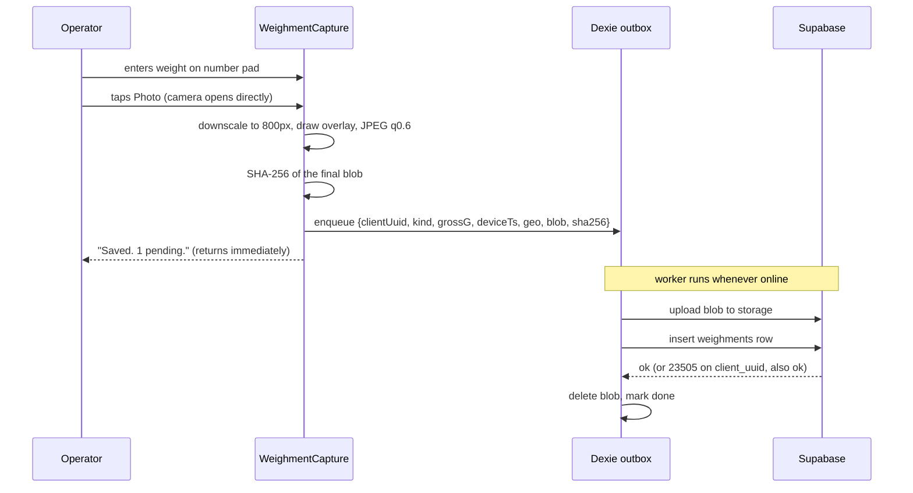

# Thread Rewinding Operations App: Build Specification

**Version:** 1.0
**Target implementer:** Claude Code
**Status:** Ready to build

> **SQL verification:** every `sql` block in this document has been executed end to end
> against PostgreSQL 16 with Supabase stubs, and exercised with 19 functional assertions
> and 15 RLS assertions, all passing. Appendix C reproduces the harness in about two minutes
> so you can re-verify after every migration you write. Six defects were found and fixed
> this way before the spec was written down; the gotcha notes throughout mark where they were.

---

## 0. How to use this document

Save this file as `SPEC.md` in the repository root. Also create a `CLAUDE.md` containing Section 3 verbatim, because those invariants must be re-read on every session.

Build in the phase order given in Section 15. Each phase has explicit acceptance criteria. Do not start a phase until the previous phase's criteria pass.

Suggested prompts:

```
Read SPEC.md and CLAUDE.md. Implement Phase 0 only.
Stop when all Phase 0 acceptance criteria pass and list how you verified each one.
```

Sections 6 through 11 contain the complete SQL. Treat it as the source of truth. If you need to deviate, state why in a comment above the change.

---

## 1. Context and constraints

### The operation

A family-run thread rewinding business. Large cones and bails of thread are purchased, rewound onto smaller tubes, packed, and delivered to shops by an in-house team.

**Product lines**

| Category | Description |
|---|---|
| `stitching_bobbin` | Thread on small tubes for stitching |
| `hotel_wrap` | Thread used in hotel packing for wrapping paper |
| `religious` | Thread for religious use |

**People and their jobs**

| Role | What they do |
|---|---|
| Owner | Runs the business, approves exceptions, reads the variance reports |
| Supervisor | Reviews flags, runs cycle counts, approves price exceptions |
| Machine operator | Runs a rewinding machine, records input and output |
| Packer | Packs orders into boxes and covers, weighs them |
| Driver | Delivers orders, collects cash, brings back new orders |
| Order taker | Takes orders by phone or by visiting shops |

In practice one person may hold several roles. The role model must support multiple roles per user.

### The problem this app solves

Stock leaves without being recorded. Specific known routes:

1. Staff take finished pieces home.
2. Staff sell stock cheap outside the books.
3. Tubes are underfilled so the count is right but the mass is short.
4. Delivered quantity is less than dispatched quantity.

### Hard constraints

- **Zero recurring spend.** No paid tiers, anywhere, at any point.
- Phone-first. Every shop-floor screen is used one-handed on an Android phone over factory wifi.
- Wifi is available but must be assumed unreliable. The app must work with the network down and sync later.
- Role-based access control must be enforced server-side. Client-side permission checks are not acceptable in a system whose purpose is auditing the people using it.

---

## 2. Architecture decisions

| Layer | Choice | Rationale |
|---|---|---|
| Database + Auth | **Supabase** (Postgres) | Row Level Security gives server-enforced RBAC. Airtable enforces permissions in the client, so the API key in the browser grants full table access, which defeats the purpose. Airtable free is also capped at 1,000 records per base. |
| Frontend | Vite + React 18 + TypeScript | Fast builds, no server runtime needed, static output deploys free. |
| Styling | Tailwind CSS | No runtime cost, large touch targets are trivial to express. |
| Server state | TanStack Query | Cache, retry and invalidation for free. |
| Offline queue | Dexie (IndexedDB) | Stores photo blobs and pending mutations. Non-negotiable, see Section 12.3. |
| Hosting | Netlify | Free tier: 100 GB bandwidth, 300 build minutes/month. Static site only. |
| Business logic | Postgres functions (RPC) | Transactional, free, and enforced regardless of client. Prefer over Edge Functions everywhere possible. |
| Scheduled work | `pg_cron` + GitHub Actions | Both free. |
| Version control / CI | GitHub | Free Actions minutes cover the nightly backup. |
| PWA | `vite-plugin-pwa` | Installs to home screen, gets the app off the browser chrome. |

### Free tier ceilings, verified

**Supabase Free:** 500 MB database, 1 GB file storage, 5 GB egress, 50,000 MAU, 500,000 Edge Function invocations, 2 active projects, **projects pause after 1 week of inactivity**, **no automatic backups**, 1 day log retention.

Two consequences that are designed for in this spec:

- Section 14.2 adds a keepalive Action so the project never pauses.
- Section 14.1 adds a nightly `pg_dump` to GitHub. Without it, a free-tier accident is unrecoverable.

**Cloudflare R2 Free** (the migration target for photos when storage fills): 10 GB storage, 1M Class A ops, 10M Class B ops, **zero egress charges**.

### Where "free" actually breaks

Photo storage is the only real ceiling. At roughly 3 photos per production job plus 1 per packed order plus 1 per delivery, 40 jobs and 30 orders a day is about 180 photos daily.

| Photo size | Daily | Monthly | 1 GB reached |
|---|---|---|---|
| 4 MB (raw phone photo) | 720 MB | 21 GB | Day 2 |
| 200 KB (naive compress) | 36 MB | 1.1 GB | Month 1 |
| **40 KB (spec'd, see 12.2)** | **7.2 MB** | **216 MB** | **Month 5** |
| 40 KB + 90-day purge | steady state ~650 MB | never |

Compression is not optional. Neither is the purge job. Together they keep you inside the free tier indefinitely.

---

## 3. Non-negotiable invariants

> Copy this section verbatim into `CLAUDE.md`.

1. **All weights are integers in grams.** Column names end in `_g`. Never store kilograms, never use floats for weight. Convert to kg at the display layer only.
2. **All money is integers in paise.** Column names end in `_paise`. Never use floats for money.
3. **`weighments` and `inventory_moves` are append-only.** No `UPDATE`, no `DELETE`, by anyone, including the owner. Corrections are new reversing rows. Database triggers enforce this. Do not add a policy or a bypass.
4. **Stock is derived, never stored.** Current stock is `sum(qty_delta)` over `inventory_moves`. Never create a mutable `stock_qty` column.
5. **Never trust the client clock.** Every event stores `device_ts` (from the phone) and `server_ts` (`DEFAULT now()`, forced by trigger). Divergence is a flag, not an error to hide.
6. **Never trust client-supplied identity.** `actor_id` is overwritten with `auth.uid()` by a `BEFORE INSERT` trigger on every event table.
7. **The `service_role` key never reaches the browser.** Only `VITE_SUPABASE_ANON_KEY` is bundled. Anything prefixed `VITE_` is public. Treat it as printed on the front door.
8. **Every mutation path goes through RLS.** No table gets a blanket `USING (true)` policy. If a screen needs data it cannot read, fix the policy, do not widen it.
9. **Idempotency by `client_uuid`.** The offline queue generates a UUID per event before the first send attempt. Retries reuse it. A unique constraint makes replay safe.
10. **Never destroy an operator's captured data.** A photo blob stays in IndexedDB until the server confirms the row insert.
11. **Flags are leads, never verdicts.** No UI copy accuses a person. Flag titles describe the measurement, not the motive.

---

## 4. Repository layout

```
rewind/
  CLAUDE.md                     # Section 3, verbatim
  SPEC.md                       # this file
  .env.example
  index.html
  package.json
  vite.config.ts
  tailwind.config.js
  tsconfig.json
  netlify.toml
  supabase/
    config.toml
    migrations/
      0001_extensions.sql
      0002_enums.sql
      0003_master_data.sql
      0004_production.sql
      0005_inventory.sql
      0006_sales.sql
      0007_delivery.sql
      0008_quality.sql          # calibration, cycle counts
      0009_flags_audit.sql
      0010_security_helpers.sql
      0011_rls_policies.sql
      0012_immutability.sql
      0013_rpc.sql
      0014_flagging.sql
      0015_views.sql
      0016_cron.sql
      0017_storage.sql
    seed.sql
  src/
    main.tsx
    App.tsx
    lib/
      supabase.ts               # client, single instance
      db.ts                     # Dexie schema
      outbox.ts                 # sync worker state machine
      image.ts                  # downscale, overlay, hash
      units.ts                  # g <-> kg, paise <-> rupees. ALL conversion here.
      roles.ts                  # role constants and guards (UI hints only)
    components/
      WeighmentCapture.tsx      # the heart of the app, see 12.2
      OutboxBadge.tsx
      NumberPad.tsx             # large-touch numeric entry
      RoleGate.tsx
    routes/
      operator/  packer/  driver/  sales/  supervisor/  owner/  shared/
    hooks/
  .github/workflows/
    backup.yml
    keepalive.yml
    purge-photos.yml
```

---

## 5. Environment and secrets

`.env.example`:

```bash
# Client-side. These ARE bundled into the JS and are public by design.
VITE_SUPABASE_URL=https://xxxxx.supabase.co
VITE_SUPABASE_ANON_KEY=eyJhbGci...
VITE_PHOTO_MAX_EDGE_PX=800
VITE_PHOTO_JPEG_QUALITY=0.6
```

Never-bundled secrets, stored as GitHub repository secrets and Supabase function secrets:

| Secret | Where it lives | Used by |
|---|---|---|
| `SUPABASE_DB_URL` | GitHub secret | `backup.yml` |
| `SUPABASE_SERVICE_ROLE_KEY` | GitHub secret, Supabase secret | `purge-photos.yml` |
| `SUPABASE_PROJECT_REF` | GitHub secret | `keepalive.yml` |

Netlify environment variables: only the two `VITE_` values.

**Guard rail to implement:** add a build-time check in `vite.config.ts` that fails the build if any env key matching `/SERVICE_ROLE|DB_URL|SECRET/i` is present with a `VITE_` prefix.

---

## 6. Database schema

### 6.1 Extensions and enums

`0001_extensions.sql`:

```sql
create extension if not exists pgcrypto;
create extension if not exists pg_cron;
```

`0002_enums.sql`:

```sql
create type user_role        as enum ('owner','supervisor','operator','packer','driver','order_taker');
create type product_category as enum ('stitching_bobbin','hotel_wrap','religious','other');
create type weighment_kind   as enum ('job_input','job_output','job_waste','pack','dispatch','cycle_count','calibration');
create type job_status       as enum ('open','closed','void');
create type order_status     as enum ('draft','confirmed','packed','dispatched','delivered','cancelled');
create type trip_status      as enum ('planned','out','returned');
create type stop_status      as enum ('pending','delivered','partial','refused','skipped');
create type flag_status      as enum ('open','explained','confirmed','dismissed');
create type flag_severity    as enum ('low','medium','high','critical');
create type payment_mode     as enum ('cash','upi','bank','cheque','credit_note');
```

### 6.2 People

`0003_master_data.sql`:

```sql
create table profiles (
  id          uuid primary key references auth.users(id) on delete cascade,
  full_name   text not null,
  phone       text,
  is_active   boolean not null default true,
  created_at  timestamptz not null default now()
);

-- Multiple roles per person. One user can be packer and driver.
create table user_roles (
  profile_id uuid not null references profiles(id) on delete cascade,
  role       user_role not null,
  primary key (profile_id, role)
);
```

### 6.3 Master data

```sql
create table tube_types (
  id        uuid primary key default gen_random_uuid(),
  code      text not null unique,
  name      text not null,
  tare_g    integer not null check (tare_g >= 0),
  is_active boolean not null default true,
  -- Tare drift is a silent killer. Re-verify when a new supplier batch arrives.
  tare_verified_at date,
  created_at timestamptz not null default now()
);

create table packaging (
  id        uuid primary key default gen_random_uuid(),
  code      text not null unique,
  name      text not null,
  kind      text not null check (kind in ('box','cover','tray')),
  tare_g    integer not null check (tare_g >= 0),
  is_active boolean not null default true
);

create table machines (
  id        uuid primary key default gen_random_uuid(),
  code      text not null unique,
  name      text not null,
  is_active boolean not null default true
);

create table machine_operators (
  machine_id uuid not null references machines(id) on delete cascade,
  profile_id uuid not null references profiles(id) on delete cascade,
  primary key (machine_id, profile_id)
);

create table scales (
  id           uuid primary key default gen_random_uuid(),
  code         text not null unique,
  location     text,
  capacity_g   integer not null,
  is_active    boolean not null default true
);

create table products (
  id               uuid primary key default gen_random_uuid(),
  code             text not null unique,
  name             text not null,
  category         product_category not null,
  tube_type_id     uuid references tube_types(id),
  target_net_g     integer not null check (target_net_g > 0),   -- thread per unit, tube excluded
  tolerance_pct    numeric(5,2) not null default 3.0,
  target_yield_pct numeric(5,2) not null default 96.0,
  price_floor_paise integer check (price_floor_paise >= 0),      -- per unit
  is_active        boolean not null default true,
  created_at       timestamptz not null default now()
);

create table raw_lots (
  id         uuid primary key default gen_random_uuid(),
  lot_code   text not null unique,
  supplier   text,
  material   text,
  count_denier text,
  received_at date not null default current_date,
  gross_g    integer not null check (gross_g > 0),
  tare_g     integer not null default 0 check (tare_g >= 0),
  net_g      integer generated always as (gross_g - tare_g) stored,
  remaining_g integer not null,
  cost_paise bigint,
  created_by uuid references profiles(id),
  created_at timestamptz not null default now()
);
create index on raw_lots (received_at desc);
```

### 6.4 Weighments: the evidence table

Every photographed weight in the system lands here. Nothing else stores a weight photo.

`0004_production.sql`:

```sql
create table weighments (
  id           uuid primary key default gen_random_uuid(),
  client_uuid  uuid not null unique,              -- idempotency key from the offline queue
  kind         weighment_kind not null,
  gross_g      integer not null check (gross_g > 0),
  scale_id     uuid references scales(id),
  photo_path   text not null,
  photo_sha256 char(64) not null,                 -- indexed, not unique: collisions are flagged, not blocked
  device_ts    timestamptz not null,              -- phone clock, untrusted
  server_ts    timestamptz not null default now(),-- forced by trigger, trusted
  lat          double precision,
  lng          double precision,
  accuracy_m   real,
  actor_id     uuid not null references profiles(id),  -- forced to auth.uid() by trigger
  note         text
);
create index on weighments (photo_sha256);
create index on weighments (actor_id, server_ts desc);
create index on weighments (kind, server_ts desc);

-- Corrections never edit a weighment. They void it and add a new one.
create table weighment_voids (
  weighment_id uuid primary key references weighments(id),
  voided_by    uuid not null references profiles(id),
  reason       text not null check (length(trim(reason)) >= 10),
  replaced_by  uuid references weighments(id),
  at           timestamptz not null default now()
);
```

### 6.5 Production

A job is a run of one product on one machine by one operator. Inputs, outputs and waste are child rows because a shift produces continuously, not in one lump.

```sql
create table production_jobs (
  id          uuid primary key default gen_random_uuid(),
  job_no      bigserial not null unique,
  machine_id  uuid not null references machines(id),
  operator_id uuid not null references profiles(id),
  product_id  uuid not null references products(id),
  shift       text check (shift in ('day','night')),
  status      job_status not null default 'open',
  started_at  timestamptz not null default now(),
  closed_at   timestamptz,
  closed_by   uuid references profiles(id),

  -- Rollups written by close_job(). Null while open.
  input_g       integer,
  output_units  integer,
  output_net_g  integer,
  waste_g       integer,

  yield_pct numeric(6,3) generated always as (
    case when input_g > 0 and output_net_g is not null
         then round(output_net_g::numeric * 100 / input_g, 3) end
  ) stored,

  waste_pct numeric(6,3) generated always as (
    case when input_g > 0 and waste_g is not null
         then round(waste_g::numeric * 100 / input_g, 3) end
  ) stored,

  -- The money line. Declared waste is separated from unexplained loss on purpose:
  -- an operator inflating waste moves waste_pct; an operator removing tubes moves this.
  unaccounted_pct numeric(6,3) generated always as (
    case when input_g > 0 and output_net_g is not null and waste_g is not null
         then round(100 - (output_net_g + waste_g)::numeric * 100 / input_g, 3) end
  ) stored,

  created_at timestamptz not null default now()
);
create index on production_jobs (product_id, machine_id, closed_at desc) where status = 'closed';
create index on production_jobs (operator_id, closed_at desc) where status = 'closed';

create table job_inputs (
  id           uuid primary key default gen_random_uuid(),
  job_id       uuid not null references production_jobs(id) on delete restrict,
  raw_lot_id   uuid not null references raw_lots(id),
  weight_g     integer not null check (weight_g > 0),
  weighment_id uuid not null references weighments(id),
  at           timestamptz not null default now()
);

create table job_outputs (
  id             uuid primary key default gen_random_uuid(),
  job_id         uuid not null references production_jobs(id) on delete restrict,
  unit_count     integer not null check (unit_count > 0),
  gross_g        integer not null check (gross_g > 0),
  tube_tare_g    integer not null check (tube_tare_g >= 0),  -- unit_count * tube_types.tare_g
  other_tare_g   integer not null default 0 check (other_tare_g >= 0), -- tray, crate
  net_g          integer generated always as (gross_g - tube_tare_g - other_tare_g) stored,
  weighment_id   uuid not null references weighments(id),
  at             timestamptz not null default now()
);

create table job_waste (
  id           uuid primary key default gen_random_uuid(),
  job_id       uuid not null references production_jobs(id) on delete restrict,
  weight_g     integer not null check (weight_g > 0),
  reason       text,
  weighment_id uuid not null references weighments(id),
  at           timestamptz not null default now()
);
```

### 6.6 Inventory ledger

`0005_inventory.sql`:

```sql
create table inventory_moves (
  id             uuid primary key default gen_random_uuid(),
  product_id     uuid not null references products(id),
  qty_delta      integer not null,          -- signed. positive in, negative out.
  weight_delta_g integer not null default 0,-- signed, same sign as qty_delta
  reason         text not null check (reason in
                   ('production','sale','return','damage','adjustment','cycle_count','opening')),
  ref_type       text,
  ref_id         uuid,
  actor_id       uuid not null references profiles(id),
  at             timestamptz not null default now(),
  note           text
);
create index on inventory_moves (product_id, at desc);
create index on inventory_moves (ref_type, ref_id);
```

`0015_views.sql`:

```sql
create view v_stock as
select p.id as product_id, p.code, p.name, p.category,
       coalesce(sum(m.qty_delta), 0)      as qty_on_hand,
       coalesce(sum(m.weight_delta_g), 0) as weight_on_hand_g
from products p
left join inventory_moves m on m.product_id = p.id
where p.is_active
group by p.id, p.code, p.name, p.category;
```

If this view gets slow past a few hundred thousand rows, convert to a materialized view refreshed by `pg_cron` every 5 minutes. Do not denormalise into a mutable column.

### 6.7 Sales

`0006_sales.sql`:

```sql
create table routes (
  id uuid primary key default gen_random_uuid(),
  name text not null unique
);

create table customers (
  id                 uuid primary key default gen_random_uuid(),
  code               text not null unique,
  shop_name          text not null,
  contact_name       text,
  phone              text,
  address            text,
  area               text,
  route_id           uuid references routes(id),
  credit_limit_paise bigint not null default 0,
  is_active          boolean not null default true,
  created_at         timestamptz not null default now()
);

create table orders (
  id           uuid primary key default gen_random_uuid(),
  order_no     bigserial not null unique,
  customer_id  uuid not null references customers(id),
  status       order_status not null default 'draft',
  channel      text check (channel in ('phone','visit','walkin')),
  taken_by     uuid not null references profiles(id),
  taken_at     timestamptz not null default now(),
  promised_for date,
  notes        text
);
create index on orders (status, taken_at desc);
create index on orders (customer_id, taken_at desc);

create table order_lines (
  id               uuid primary key default gen_random_uuid(),
  order_id         uuid not null references orders(id) on delete cascade,
  product_id       uuid not null references products(id),
  qty              integer not null check (qty > 0),
  unit_price_paise integer not null check (unit_price_paise >= 0),
  line_total_paise bigint generated always as (qty::bigint * unit_price_paise) stored,
  approved_by      uuid references profiles(id),   -- required if below price floor
  approval_reason  text
);

create table packing_events (
  id           uuid primary key default gen_random_uuid(),
  order_id     uuid not null references orders(id),
  packer_id    uuid not null references profiles(id),
  packaging_id uuid references packaging(id),
  unit_count   integer not null check (unit_count > 0),
  weighment_id uuid not null references weighments(id),
  packed_at    timestamptz not null default now()
);
```

### 6.8 Delivery and money

`0007_delivery.sql`:

```sql
create table trips (
  id         uuid primary key default gen_random_uuid(),
  trip_no    bigserial not null unique,
  driver_id  uuid not null references profiles(id),
  vehicle    text,
  trip_date  date not null default current_date,
  status     trip_status not null default 'planned',
  started_at timestamptz,
  ended_at   timestamptz
);

create table trip_stops (
  id                  uuid primary key default gen_random_uuid(),
  trip_id             uuid not null references trips(id) on delete cascade,
  order_id            uuid not null references orders(id),
  seq                 integer not null,
  status              stop_status not null default 'pending',
  dispatched_qty      integer,
  delivered_qty       integer,
  receiver_name       text,
  proof_photo_path    text,
  cash_collected_paise bigint not null default 0,
  delivered_at        timestamptz,
  lat                 double precision,
  lng                 double precision,
  unique (trip_id, seq)
);

create table payments (
  id           uuid primary key default gen_random_uuid(),
  customer_id  uuid not null references customers(id),
  order_id     uuid references orders(id),
  amount_paise bigint not null check (amount_paise > 0),
  mode         payment_mode not null,
  collected_by uuid not null references profiles(id),
  collected_at timestamptz not null default now(),
  deposited_at timestamptz,       -- null means cash is still with the driver
  reference    text
);
create index on payments (collected_by, collected_at desc) where deposited_at is null;
```

### 6.9 Quality controls

`0008_quality.sql`:

```sql
create table reference_weights (
  id        uuid primary key default gen_random_uuid(),
  code      text not null unique,
  nominal_g integer not null check (nominal_g > 0)
);

-- Daily one-minute task. Without it you cannot tell scale drift from theft,
-- and you will eventually accuse an honest person.
create table calibration_checks (
  id                  uuid primary key default gen_random_uuid(),
  scale_id            uuid not null references scales(id),
  reference_weight_id uuid not null references reference_weights(id),
  observed_g          integer not null check (observed_g > 0),
  nominal_g           integer not null,
  deviation_g         integer generated always as (observed_g - nominal_g) stored,
  weighment_id        uuid not null references weighments(id),
  checked_by          uuid not null references profiles(id),
  checked_at          timestamptz not null default now()
);
create index on calibration_checks (scale_id, checked_at desc);

-- Off-book sales are invisible to yield analysis. Only a physical count finds them.
create table cycle_counts (
  id              uuid primary key default gen_random_uuid(),
  product_id      uuid not null references products(id),
  counted_qty     integer not null check (counted_qty >= 0),
  counted_weight_g integer,
  system_qty      integer not null,
  variance_qty    integer generated always as (counted_qty - system_qty) stored,
  weighment_id    uuid references weighments(id),
  counted_by      uuid not null references profiles(id),
  counted_at      timestamptz not null default now(),
  note            text
);
```

### 6.10 Flags and audit

`0009_flags_audit.sql`:

```sql
create table flags (
  id           uuid primary key default gen_random_uuid(),
  code         text not null,              -- see Appendix A
  severity     flag_severity not null,
  entity_type  text not null,
  entity_id    uuid not null,
  title        text not null,              -- describes the measurement, never the motive
  detail       jsonb not null default '{}'::jsonb,
  status       flag_status not null default 'open',
  created_at   timestamptz not null default now(),
  assigned_to  uuid references profiles(id),
  resolved_by  uuid references profiles(id),
  resolved_at  timestamptz,
  resolution_note text
);
create index on flags (status, severity, created_at desc);
create unique index on flags (code, entity_type, entity_id) where status = 'open';

create table audit_log (
  id         bigserial primary key,
  table_name text not null,
  row_id     text not null,
  action     text not null,
  actor_id   uuid,
  before     jsonb,
  after      jsonb,
  at         timestamptz not null default now()
);
create index on audit_log (table_name, row_id, at desc);
```

The partial unique index on `flags` prevents the same open flag being raised twice for the same entity, which is what turns a working alert system into noise nobody reads.

---

## 7. Security layer

### 7.1 Role helpers

**Critical gotcha:** an RLS policy on `profiles` that reads `profiles` causes infinite recursion. Every role check must go through a `SECURITY DEFINER` function, which bypasses RLS on the tables it touches.

`0010_security_helpers.sql`:

```sql
create or replace function has_role(p_role user_role)
returns boolean
language sql stable security definer set search_path = public as $$
  select exists (
    select 1 from user_roles ur
    join profiles p on p.id = ur.profile_id
    where ur.profile_id = auth.uid() and ur.role = p_role and p.is_active
  );
$$;

create or replace function is_owner() returns boolean
language sql stable security definer set search_path = public as $$
  select has_role('owner');
$$;

-- Supervisor or above. Used for every "can see everything" check.
create or replace function is_supervisor_up() returns boolean
language sql stable security definer set search_path = public as $$
  select has_role('owner') or has_role('supervisor');
$$;

create or replace function operates_machine(p_machine_id uuid) returns boolean
language sql stable security definer set search_path = public as $$
  select exists (
    select 1 from machine_operators
    where machine_id = p_machine_id and profile_id = auth.uid()
  );
$$;

create or replace function drives_trip_for_order(p_order_id uuid) returns boolean
language sql stable security definer set search_path = public as $$
  select exists (
    select 1 from trip_stops ts
    join trips t on t.id = ts.trip_id
    where ts.order_id = p_order_id and t.driver_id = auth.uid()
      and t.trip_date >= current_date - 1
  );
$$;

revoke all on function has_role(user_role), is_owner(), is_supervisor_up(),
  operates_machine(uuid), drives_trip_for_order(uuid) from public, anon;
grant execute on function has_role(user_role), is_owner(), is_supervisor_up(),
  operates_machine(uuid), drives_trip_for_order(uuid) to authenticated;
```

### 7.2 RLS policies

`0011_rls_policies.sql`. Enable RLS on **every** table, then add policies. A table with RLS enabled and no policy is closed to everyone except `service_role`, which is the correct default.

```sql
do $$
declare t text;
begin
  for t in
    select tablename from pg_tables
    where schemaname = 'public' and tablename not like 'pg_%'
  loop
    execute format('alter table public.%I enable row level security', t);
    execute format('revoke all on public.%I from anon', t);
  end loop;
end $$;
```

**Profiles and roles**

```sql
create policy p_profiles_self on profiles for select to authenticated
  using (id = auth.uid() or is_supervisor_up());
create policy p_profiles_owner_write on profiles for all to authenticated
  using (is_owner()) with check (is_owner());

create policy p_roles_read on user_roles for select to authenticated
  using (profile_id = auth.uid() or is_supervisor_up());
create policy p_roles_owner_write on user_roles for all to authenticated
  using (is_owner()) with check (is_owner());
```

**Master data.** Everyone reads, owner writes.

```sql
do $$
declare t text;
begin
  foreach t in array array['tube_types','packaging','machines','scales','products',
                           'routes','reference_weights','machine_operators'] loop
    execute format($f$
      create policy p_%1$s_read on %1$I for select to authenticated using (true);
      create policy p_%1$s_write on %1$I for all to authenticated
        using (is_owner()) with check (is_owner());
    $f$, t);
  end loop;
end $$;
```

**Weighments.** Insert only, read own or supervisor. No update or delete policy exists, on purpose.

```sql
create policy p_weigh_insert on weighments for insert to authenticated
  with check (actor_id = auth.uid());
create policy p_weigh_read on weighments for select to authenticated
  using (actor_id = auth.uid() or is_supervisor_up());

create policy p_wvoid_read on weighment_voids for select to authenticated
  using (is_supervisor_up());
create policy p_wvoid_write on weighment_voids for insert to authenticated
  with check (is_supervisor_up() and voided_by = auth.uid());
```

**Production.** An operator sees and touches only their own jobs, on machines they are assigned to.

```sql
create policy p_jobs_read on production_jobs for select to authenticated
  using (operator_id = auth.uid() or is_supervisor_up());
create policy p_jobs_insert on production_jobs for insert to authenticated
  with check (
    operator_id = auth.uid()
    and operates_machine(machine_id)
    and has_role('operator')
  );
-- Only while open, and only your own.
create policy p_jobs_update on production_jobs for update to authenticated
  using (operator_id = auth.uid() and status = 'open')
  with check (operator_id = auth.uid());

create policy p_jobs_sup_update on production_jobs for update to authenticated
  using (is_supervisor_up()) with check (is_supervisor_up());

-- Child tables follow the parent.
do $$
declare t text;
begin
  foreach t in array array['job_inputs','job_outputs','job_waste'] loop
    execute format($f$
      create policy p_%1$s_read on %1$I for select to authenticated
        using (exists (select 1 from production_jobs j where j.id = %1$I.job_id
               and (j.operator_id = auth.uid() or is_supervisor_up())));
      create policy p_%1$s_insert on %1$I for insert to authenticated
        with check (exists (select 1 from production_jobs j where j.id = job_id
               and j.operator_id = auth.uid() and j.status = 'open'));
    $f$, t);
  end loop;
end $$;
```

**Raw material.** Operators must be able to pick a lot when starting a job. Only a supervisor books stock in.

```sql
create policy p_lots_read on raw_lots for select to authenticated using (true);
create policy p_lots_write on raw_lots for all to authenticated
  using (is_supervisor_up()) with check (is_supervisor_up());
```

**Inventory.** Read is wide, write is system-only. Nothing inserts here directly from a client: `close_job()` and the order RPCs post the moves.

```sql
create policy p_moves_read on inventory_moves for select to authenticated using (true);
create policy p_moves_insert on inventory_moves for insert to authenticated
  with check (is_supervisor_up() and actor_id = auth.uid());
```

**Sales.**

```sql
create policy p_cust_read on customers for select to authenticated using (true);
create policy p_cust_write on customers for all to authenticated
  using (has_role('order_taker') or is_supervisor_up())
  with check (has_role('order_taker') or is_supervisor_up());

create policy p_orders_read on orders for select to authenticated
  using (
    is_supervisor_up()
    or taken_by = auth.uid()
    or (has_role('packer') and status in ('confirmed','packed'))
    or drives_trip_for_order(id)
  );
create policy p_orders_insert on orders for insert to authenticated
  with check ((has_role('order_taker') or is_supervisor_up()) and taken_by = auth.uid());
create policy p_orders_update on orders for update to authenticated
  using (
    is_supervisor_up()
    or (has_role('packer') and status = 'confirmed')
    or (taken_by = auth.uid() and status = 'draft')
  );

create policy p_lines_read on order_lines for select to authenticated
  using (exists (select 1 from orders o where o.id = order_id));   -- inherits order RLS
create policy p_lines_write on order_lines for all to authenticated
  using (exists (select 1 from orders o where o.id = order_id
                 and o.status = 'draft' and (o.taken_by = auth.uid() or is_supervisor_up())))
  with check (exists (select 1 from orders o where o.id = order_id
                 and o.status = 'draft' and (o.taken_by = auth.uid() or is_supervisor_up())));

create policy p_pack_read on packing_events for select to authenticated
  using (packer_id = auth.uid() or is_supervisor_up());
create policy p_pack_insert on packing_events for insert to authenticated
  with check (has_role('packer') and packer_id = auth.uid());
```

**Delivery.** A driver sees their own trip and nothing else. This matters: the delivery list is also a list of every customer and price you have.

```sql
create policy p_trips_read on trips for select to authenticated
  using (driver_id = auth.uid() or is_supervisor_up());
create policy p_trips_write on trips for all to authenticated
  using (is_supervisor_up()) with check (is_supervisor_up());

create policy p_stops_read on trip_stops for select to authenticated
  using (exists (select 1 from trips t where t.id = trip_id
                 and (t.driver_id = auth.uid() or is_supervisor_up())));
create policy p_stops_update on trip_stops for update to authenticated
  using (exists (select 1 from trips t where t.id = trip_id and t.driver_id = auth.uid()))
  with check (status in ('delivered','partial','refused','skipped'));
create policy p_stops_sup on trip_stops for all to authenticated
  using (is_supervisor_up()) with check (is_supervisor_up());

create policy p_pay_read on payments for select to authenticated
  using (collected_by = auth.uid() or is_supervisor_up());
create policy p_pay_insert on payments for insert to authenticated
  with check (collected_by = auth.uid());
create policy p_pay_deposit on payments for update to authenticated
  using (is_supervisor_up()) with check (is_supervisor_up());
```

**Quality and flags.**

```sql
create policy p_cal_read on calibration_checks for select to authenticated using (true);
create policy p_cal_insert on calibration_checks for insert to authenticated
  with check (checked_by = auth.uid());

create policy p_cc_read on cycle_counts for select to authenticated using (is_supervisor_up());
create policy p_cc_insert on cycle_counts for insert to authenticated
  with check (is_supervisor_up() and counted_by = auth.uid());

create policy p_flags_read on flags for select to authenticated using (is_supervisor_up());
create policy p_flags_update on flags for update to authenticated
  using (is_supervisor_up()) with check (is_supervisor_up());
-- Flags are raised only by SECURITY DEFINER functions. No insert policy.

create policy p_audit_read on audit_log for select to authenticated using (is_owner());
```

### 7.3 Immutability and forced server values

`0012_immutability.sql`:

```sql
create or replace function fn_block_mutation() returns trigger
language plpgsql as $$
begin
  raise exception
    'Table % is append-only. Post a reversing or voiding entry instead of editing row %.',
    tg_table_name, coalesce(old.id::text, '?')
    using errcode = 'restrict_violation';
end $$;

create trigger trg_weighments_no_update before update on weighments
  for each row execute function fn_block_mutation();
create trigger trg_weighments_no_delete before delete on weighments
  for each row execute function fn_block_mutation();
create trigger trg_moves_no_update before update on inventory_moves
  for each row execute function fn_block_mutation();
create trigger trg_moves_no_delete before delete on inventory_moves
  for each row execute function fn_block_mutation();

-- Belt and braces. See the note below on why the trigger alone is not enough.
revoke update, delete on
  weighments, inventory_moves, job_inputs, job_outputs, job_waste,
  packing_events, calibration_checks, cycle_counts, weighment_voids, audit_log
  from authenticated;

-- Closed jobs freeze. Voiding is a status change performed by the RPC only.
create or replace function fn_block_closed_job_edit() returns trigger
language plpgsql as $$
begin
  if old.status = 'closed' and new.status = 'closed' then
    raise exception 'Job % is closed. Raise a correction job instead.', old.job_no
      using errcode = 'restrict_violation';
  end if;
  return new;
end $$;
create trigger trg_jobs_freeze before update on production_jobs
  for each row execute function fn_block_closed_job_edit();

-- Never trust the client for time or identity.
create or replace function fn_force_server_fields() returns trigger
language plpgsql as $$
begin
  new.server_ts := now();
  if auth.uid() is not null then
    new.actor_id := auth.uid();
  end if;
  return new;
end $$;
create trigger trg_weighments_force before insert on weighments
  for each row execute function fn_force_server_fields();

-- Generic audit trail.
create or replace function fn_audit() returns trigger
language plpgsql security definer set search_path = public as $$
declare v_before jsonb; v_after jsonb;
begin
  -- Note: a record cannot be cast to jsonb directly. to_jsonb() is required.
  if tg_op in ('UPDATE','DELETE') then v_before := to_jsonb(old); end if;
  if tg_op in ('INSERT','UPDATE') then v_after  := to_jsonb(new); end if;

  insert into audit_log(table_name, row_id, action, actor_id, before, after)
  values (tg_table_name,
          coalesce(v_after ->> 'id', v_before ->> 'id', '?'),
          tg_op, auth.uid(), v_before, v_after);
  return null;
end $$;

do $$
declare t text;
begin
  foreach t in array array['products','tube_types','packaging','raw_lots','production_jobs',
                           'orders','order_lines','customers','trip_stops','payments',
                           'user_roles','flags','cycle_counts'] loop
    execute format(
      'create trigger trg_%1$s_audit after insert or update or delete on %1$I
       for each row execute function fn_audit()', t);
  end loop;
end $$;
```

### 7.4 Storage

`0017_storage.sql`. Create a **private** bucket `weighment-photos`.

```sql
insert into storage.buckets (id, name, public, file_size_limit, allowed_mime_types)
values ('weighment-photos', 'weighment-photos', false, 524288, array['image/jpeg'])
on conflict (id) do nothing;

create policy p_photo_upload on storage.objects for insert to authenticated
  with check (bucket_id = 'weighment-photos');

create policy p_photo_read on storage.objects for select to authenticated
  using (bucket_id = 'weighment-photos' and is_supervisor_up());
```

No update policy and no delete policy means nobody, including the owner, can alter or remove a photo through the API. The retention purge runs with the service key from a GitHub Action.

`file_size_limit` of 512 KB is a hard backstop against an uncompressed upload slipping through and eating the storage tier.

Path convention: `weighment-photos/{yyyy}/{mm}/{client_uuid}.jpg`. Year and month prefixes make the retention purge a cheap prefix listing rather than a full scan.

Reading a photo in the supervisor UI uses `createSignedUrl(path, 60)`. Never make the bucket public.

---

## 8. Business logic (RPC)

> **Why `SECURITY DEFINER` works here:** migrations run as `postgres`, which owns these tables, and a table owner is exempt from RLS unless `FORCE ROW LEVEL SECURITY` is set. So a definer function can post to `inventory_moves` even though no client role has an insert policy for it. Do not set `FORCE ROW LEVEL SECURITY` on these tables.

`0013_rpc.sql`:

### 8.1 Raising a flag

```sql
create or replace function fn_raise_flag(
  p_code text, p_severity flag_severity, p_entity_type text,
  p_entity_id uuid, p_title text, p_detail jsonb default '{}'::jsonb
) returns void
language plpgsql security definer set search_path = public as $$
begin
  insert into flags(code, severity, entity_type, entity_id, title, detail)
  values (p_code, p_severity, p_entity_type, p_entity_id, p_title, p_detail)
  on conflict do nothing;   -- the partial unique index dedupes open flags
end $$;
```

> **Gotcha 1:** PostgreSQL's `format()` supports only `%s`, `%I`, `%L` and `%%`. There is no
> printf precision: `%.2f` raises `unrecognized format() type specifier "."` at runtime.
> `RAISE` is the same. Round the value first and pass it to `%s`, or use `to_char()` for money.
> Every message below already does this.
>
> **Gotcha 2:** a bare string literal coerces to `flag_severity` automatically, but a `CASE`
> expression is typed `text` and will not, so the call fails to resolve at runtime with
> `function fn_raise_flag(...) does not exist`. Every computed severity below carries an
> explicit `::flag_severity` cast. Keep it.

### 8.2 Closing a job

This is the single most important function in the system. Everything downstream reads what it writes.

```sql
create or replace function close_job(p_job_id uuid)
returns production_jobs
language plpgsql security definer set search_path = public as $$
declare
  j production_jobs;
  v_input_g integer; v_units integer; v_net_g integer; v_waste_g integer;
begin
  select * into j from production_jobs where id = p_job_id for update;
  if not found then
    raise exception 'Job not found' using errcode = 'no_data_found';
  end if;
  if j.status <> 'open' then
    raise exception 'Job % is already %', j.job_no, j.status using errcode = 'check_violation';
  end if;
  if not (j.operator_id = auth.uid() or is_supervisor_up()) then
    raise exception 'Not permitted to close job %', j.job_no using errcode = 'insufficient_privilege';
  end if;

  select coalesce(sum(weight_g), 0) into v_input_g from job_inputs where job_id = p_job_id;
  select coalesce(sum(unit_count), 0), coalesce(sum(net_g), 0)
    into v_units, v_net_g from job_outputs where job_id = p_job_id;
  select coalesce(sum(weight_g), 0) into v_waste_g from job_waste where job_id = p_job_id;

  if v_input_g = 0 then
    raise exception 'Job % has no input weighment', j.job_no using errcode = 'check_violation';
  end if;
  if v_units = 0 then
    raise exception 'Job % has no output weighment', j.job_no using errcode = 'check_violation';
  end if;

  update production_jobs set
    status = 'closed', closed_at = now(), closed_by = auth.uid(),
    input_g = v_input_g, output_units = v_units,
    output_net_g = v_net_g, waste_g = v_waste_g
  where id = p_job_id
  returning * into j;

  -- Draw down the raw lots this job consumed.
  update raw_lots rl
  set remaining_g = greatest(rl.remaining_g - ji.used_g, 0)
  from (select raw_lot_id, sum(weight_g) as used_g
        from job_inputs where job_id = p_job_id group by raw_lot_id) ji
  where rl.id = ji.raw_lot_id;

  -- Post finished goods to the ledger.
  insert into inventory_moves(product_id, qty_delta, weight_delta_g, reason,
                              ref_type, ref_id, actor_id)
  values (j.product_id, v_units, v_net_g, 'production',
          'production_job', p_job_id, coalesce(auth.uid(), j.operator_id));

  perform fn_check_job_flags(p_job_id);
  return j;
end $$;

grant execute on function close_job(uuid) to authenticated;
```

### 8.3 Dispatching and delivering

```sql
create or replace function dispatch_trip(p_trip_id uuid)
returns void
language plpgsql security definer set search_path = public as $$
declare s record;
begin
  if not is_supervisor_up() then
    raise exception 'Only a supervisor can dispatch' using errcode = 'insufficient_privilege';
  end if;

  for s in select ts.id, ts.order_id from trip_stops ts where ts.trip_id = p_trip_id loop
    update trip_stops
      set dispatched_qty = (select sum(qty) from order_lines where order_id = s.order_id)
      where id = s.id;

    insert into inventory_moves(product_id, qty_delta, weight_delta_g, reason,
                                ref_type, ref_id, actor_id)
    select ol.product_id, -ol.qty, -(ol.qty * p.target_net_g), 'sale',
           'order', s.order_id, auth.uid()
    from order_lines ol join products p on p.id = ol.product_id
    where ol.order_id = s.order_id;

    update orders set status = 'dispatched' where id = s.order_id;
  end loop;

  update trips set status = 'out', started_at = now() where id = p_trip_id;
end $$;

create or replace function deliver_stop(
  p_stop_id uuid, p_delivered_qty integer, p_receiver text,
  p_proof_path text, p_cash_paise bigint default 0
) returns void
language plpgsql security definer set search_path = public as $$
declare st trip_stops; ord_id uuid;
begin
  select * into st from trip_stops where id = p_stop_id;
  if not exists (select 1 from trips t where t.id = st.trip_id and t.driver_id = auth.uid())
     and not is_supervisor_up() then
    raise exception 'Not your stop' using errcode = 'insufficient_privilege';
  end if;

  update trip_stops set
    delivered_qty = p_delivered_qty,
    receiver_name = p_receiver,
    proof_photo_path = p_proof_path,
    cash_collected_paise = p_cash_paise,
    delivered_at = now(),
    status = case when p_delivered_qty = st.dispatched_qty then 'delivered'
                  when p_delivered_qty = 0 then 'refused' else 'partial' end
  where id = p_stop_id
  returning order_id into ord_id;

  update orders set status = 'delivered' where id = ord_id;

  if p_cash_paise > 0 then
    insert into payments(customer_id, order_id, amount_paise, mode, collected_by)
    select o.customer_id, o.id, p_cash_paise, 'cash', auth.uid()
    from orders o where o.id = ord_id;
  end if;

  -- Short delivery returns the difference to stock and raises a flag.
  if p_delivered_qty < st.dispatched_qty then
    insert into inventory_moves(product_id, qty_delta, weight_delta_g, reason,
                                ref_type, ref_id, actor_id, note)
    select ol.product_id,
           st.dispatched_qty - p_delivered_qty,
           (st.dispatched_qty - p_delivered_qty) * p.target_net_g,
           'return', 'trip_stop', p_stop_id, auth.uid(), 'short delivery'
    from order_lines ol join products p on p.id = ol.product_id
    where ol.order_id = ord_id
    limit 1;

    perform fn_raise_flag('DELIVERY_SHORTFALL', 'high', 'trip_stop', p_stop_id,
      format('Dispatched %s, delivered %s', st.dispatched_qty, p_delivered_qty),
      jsonb_build_object('dispatched', st.dispatched_qty, 'delivered', p_delivered_qty));
  end if;
end $$;

grant execute on function dispatch_trip(uuid), deliver_stop(uuid, integer, text, text, bigint)
  to authenticated;
```

### 8.4 Price floor enforcement

```sql
create or replace function fn_enforce_price_floor() returns trigger
language plpgsql security definer set search_path = public as $$
declare v_floor integer; v_code text;
begin
  select price_floor_paise, code into v_floor, v_code from products where id = new.product_id;

  if v_floor is not null and new.unit_price_paise < v_floor then
    if new.approved_by is null then
      raise exception
        'Price % for % is below the floor of %. Supervisor approval is required.',
        to_char(new.unit_price_paise / 100.0, 'FM999999990.00'), v_code,
        to_char(v_floor / 100.0, 'FM999999990.00')
        using errcode = 'check_violation';
    end if;
    if not exists (select 1 from user_roles
                   where profile_id = new.approved_by and role in ('owner','supervisor')) then
      raise exception 'Approver is not a supervisor or owner.'
        using errcode = 'insufficient_privilege';
    end if;
    perform fn_raise_flag('PRICE_BELOW_FLOOR', 'medium', 'order_line', new.id,
      format('%s sold at %s against a floor of %s', v_code,
             to_char(new.unit_price_paise / 100.0, 'FM999999990.00'),
             to_char(v_floor / 100.0, 'FM999999990.00')),
      jsonb_build_object('price_paise', new.unit_price_paise, 'floor_paise', v_floor,
                         'approved_by', new.approved_by));
  end if;
  return new;
end $$;

create trigger trg_price_floor before insert or update on order_lines
  for each row execute function fn_enforce_price_floor();
```

This is a **block**, not a flag. A cheap sale cannot be recorded without a named approver. That single constraint closes the "sell it cheap" route on the books, which then forces the loss into channels the other rules watch.

---

## 9. The flagging engine

`0014_flagging.sql`.

### 9.1 Baseline statistics

Median and median absolute deviation, not mean and standard deviation. One bad job should not move the threshold that judges the next one.

```sql
create or replace function fn_yield_baseline(
  p_product_id uuid, p_machine_id uuid, p_exclude uuid
) returns table (n integer, med numeric, mad numeric)
language sql stable security definer set search_path = public as $$
  with base as (
    select yield_pct from production_jobs
    where product_id = p_product_id and machine_id = p_machine_id
      and status = 'closed' and yield_pct is not null
      and (p_exclude is null or id <> p_exclude)
    order by closed_at desc limit 20
  ),
  m as (
    select percentile_cont(0.5) within group (order by yield_pct::double precision)::numeric as med
    from base
  )
  select (select count(*)::integer from base),
         (select med from m),
         (select percentile_cont(0.5) within group
                 (order by abs(yield_pct - (select med from m))::double precision)::numeric
          from base);
$$;
```

### 9.2 Per-job checks

```sql
create or replace function fn_check_job_flags(p_job_id uuid) returns void
language plpgsql security definer set search_path = public as $$
declare
  j production_jobs; p products; b record;
  unit_g numeric; lo numeric; hi numeric; thresh numeric; loss_g numeric;
begin
  select * into j from production_jobs where id = p_job_id;
  select * into p from products where id = j.product_id;

  ---------------------------------------------------------------- Rule 1
  -- Average unit weight outside spec. Catches underfilling, where the count
  -- is correct and the mass is short.
  if j.output_units > 0 then
    unit_g := j.output_net_g::numeric / j.output_units;
    lo := p.target_net_g * (1 - p.tolerance_pct / 100);
    hi := p.target_net_g * (1 + p.tolerance_pct / 100);
    if unit_g < lo or unit_g > hi then
      perform fn_raise_flag('UNIT_WEIGHT_OUT_OF_SPEC',
        (case when unit_g < lo * 0.95 then 'high' else 'medium' end)::flag_severity,
        'production_job', p_job_id,
        format('Average unit weight %s g against a spec of %s g plus or minus %s%%',
               round(unit_g, 1), p.target_net_g, p.tolerance_pct),
        jsonb_build_object('unit_g', round(unit_g, 2), 'lo', round(lo, 2), 'hi', round(hi, 2)));
    end if;
  end if;

  ---------------------------------------------------------------- Rule 2
  -- Yield below the rolling baseline for this product on this machine.
  select * into b from fn_yield_baseline(j.product_id, j.machine_id, p_job_id);
  if b.n >= 10 and b.med is not null then
    -- The 1.4826 factor converts MAD into a standard-deviation equivalent.
    -- The 0.75 floor stops a very consistent machine from firing on trivial noise.
    thresh := greatest(coalesce(b.mad, 0) * 1.4826 * 3, 0.75);
    if j.yield_pct < b.med - thresh then
      loss_g := round(j.input_g * (b.med - j.yield_pct) / 100);
      perform fn_raise_flag('YIELD_BELOW_BASELINE',
        (case when j.yield_pct < b.med - thresh * 2 then 'high' else 'medium' end)::flag_severity,
        'production_job', p_job_id,
        format('Yield %s%% against a baseline of %s%% over the last %s jobs. Difference is about %s g.',
               round(j.yield_pct, 2), round(b.med, 2), b.n, loss_g),
        jsonb_build_object('yield_pct', j.yield_pct, 'baseline_pct', b.med,
                           'mad', b.mad, 'n', b.n, 'delta_g', loss_g));
    end if;
  end if;

  ---------------------------------------------------------------- Rule 3
  -- Unexplained loss. Input minus output minus declared waste.
  -- This is the signature of stock leaving without a record.
  if j.unaccounted_pct is not null and j.unaccounted_pct > 2.0 then
    perform fn_raise_flag('UNACCOUNTED_LOSS',
      (case when j.unaccounted_pct > 5 then 'critical'
            when j.unaccounted_pct > 3 then 'high' else 'medium' end)::flag_severity,
      'production_job', p_job_id,
      format('%s%% of input is neither output nor declared waste (%s g)',
             round(j.unaccounted_pct, 2), round(j.input_g * j.unaccounted_pct / 100)),
      jsonb_build_object('unaccounted_pct', j.unaccounted_pct, 'input_g', j.input_g));
  end if;

  ---------------------------------------------------------------- Rule 4
  -- Declared waste well above this product's own norm. The counterpart to
  -- Rule 3: inflating waste is how you hide a shortfall from a yield check.
  if j.waste_pct is not null then
    if j.waste_pct > greatest(
         2 * coalesce((select percentile_cont(0.5) within group (order by waste_pct::double precision)
                       from production_jobs
                       where product_id = j.product_id and status = 'closed'
                         and id <> p_job_id and waste_pct is not null), 1.0), 3.0) then
      perform fn_raise_flag('WASTE_INFLATED', 'medium', 'production_job', p_job_id,
        format('Declared waste %s%% is well above the norm for this product', round(j.waste_pct, 2)),
        jsonb_build_object('waste_pct', j.waste_pct));
    end if;
  end if;
end $$;
```

> **Deliberately not a rule here:** "scale not calibrated today" was tested as a per-job flag
> and produced one flag per job on any uncalibrated day, which is precisely the alert fatigue
> this section warns about. It belongs in two places instead: a single daily flag from
> `fn_daily_checks` (Section 9.5), and a banner on the job screen driven by
> `select exists(select 1 from calibration_checks where checked_at >= current_date
> and abs(deviation_g) <= 2)`. Same information, one alert instead of forty.

### 9.3 Evidence integrity

```sql
create or replace function fn_check_weighment_integrity() returns trigger
language plpgsql security definer set search_path = public as $$
declare skew numeric;
begin
  -- A real camera never produces two byte-identical images.
  -- A match means an old photo was re-submitted.
  if exists (select 1 from weighments
             where photo_sha256 = new.photo_sha256 and id <> new.id) then
    perform fn_raise_flag('DUPLICATE_PHOTO', 'critical', 'weighment', new.id,
      'This photo has already been submitted for another weighment',
      jsonb_build_object('sha256', new.photo_sha256,
        'first_seen', (select min(server_ts) from weighments
                       where photo_sha256 = new.photo_sha256)));
  end if;

  skew := abs(extract(epoch from (new.server_ts - new.device_ts)));
  if skew > 300 then
    perform fn_raise_flag('CLOCK_SKEW',
      (case when skew > 86400 then 'high' else 'low' end)::flag_severity,
      'weighment', new.id,
      format('Device clock differs from server by %s minutes', round(skew / 60)),
      jsonb_build_object('skew_s', round(skew)));
  end if;
  return null;
end $$;

create trigger trg_weighment_integrity after insert on weighments
  for each row execute function fn_check_weighment_integrity();
```

### 9.4 The operator scorecard

Single-job flags find bad lots, machine faults and scale drift. **A person's thirty-day average is what finds a pattern.** Report it in kilograms, not percentages, because that is the number the owner can act on.

```sql
create materialized view mv_operator_yield_30d as
select
  j.operator_id, j.product_id, j.machine_id,
  count(*)::integer                 as jobs,
  sum(j.input_g)::bigint            as input_g,
  round(avg(j.yield_pct), 3)        as avg_yield_pct,
  round(avg(j.unaccounted_pct), 3)  as avg_unaccounted_pct
from production_jobs j
where j.status = 'closed' and j.closed_at >= now() - interval '30 days'
group by 1, 2, 3;

create unique index on mv_operator_yield_30d (operator_id, product_id, machine_id);

create or replace function fn_operator_scorecard_flags() returns void
language plpgsql security definer set search_path = public as $$
declare r record; peer numeric; gap numeric; loss_g numeric;
begin
  for r in select * from mv_operator_yield_30d where jobs >= 20 loop
    select percentile_cont(0.5) within group (order by avg_yield_pct::double precision)::numeric
      into peer
    from mv_operator_yield_30d
    where product_id = r.product_id and machine_id = r.machine_id
      and operator_id <> r.operator_id and jobs >= 10;

    continue when peer is null;
    gap := peer - r.avg_yield_pct;

    if gap > 1.5 then
      loss_g := round(r.input_g * gap / 100);
      perform fn_raise_flag('OPERATOR_YIELD_GAP',
        (case when gap > 3 then 'high' else 'medium' end)::flag_severity,
        'profile', r.operator_id,
        format('Thirty-day yield %s%% against a peer median of %s%% on the same product and machine, across %s jobs. The gap represents about %s kg.',
               round(r.avg_yield_pct, 2), round(peer, 2), r.jobs, round(loss_g / 1000.0, 1)),
        jsonb_build_object('gap_pp', gap, 'est_loss_g', loss_g, 'jobs', r.jobs,
                           'product_id', r.product_id, 'machine_id', r.machine_id));
    end if;
  end loop;
end $$;
```

### 9.5 Daily housekeeping

```sql
create or replace function fn_daily_checks() returns void
language plpgsql security definer set search_path = public as $$
declare r record;
begin
  -- Calibration missed
  if not exists (select 1 from calibration_checks where checked_at >= current_date) then
    perform fn_raise_flag('CALIBRATION_MISSED', 'medium', 'scale',
      (select id from scales where is_active limit 1),
      'No scale calibration was recorded yesterday', '{}'::jsonb);
  end if;

  -- Jobs left open overnight
  for r in select id, job_no from production_jobs
           where status = 'open' and started_at < now() - interval '24 hours' loop
    perform fn_raise_flag('JOB_LEFT_OPEN', 'low', 'production_job', r.id,
      format('Job %s has been open for more than 24 hours', r.job_no), '{}'::jsonb);
  end loop;

  -- Cash still with a driver after two days
  for r in select collected_by, sum(amount_paise) amt from payments
           where deposited_at is null and mode = 'cash'
             and collected_at < now() - interval '48 hours'
           group by collected_by loop
    perform fn_raise_flag('CASH_NOT_DEPOSITED', 'high', 'profile', r.collected_by,
      format('%s in cash collected more than 48 hours ago is not yet deposited',
             to_char(r.amt / 100.0, 'FM999999990.00')),
      jsonb_build_object('amount_paise', r.amt));
  end loop;

  -- Stock has drifted from the last physical count
  for r in select cc.product_id, cc.variance_qty, p.code from cycle_counts cc
           join products p on p.id = cc.product_id
           where cc.counted_at >= current_date - 1 and abs(cc.variance_qty) > 0 loop
    perform fn_raise_flag('CYCLE_COUNT_VARIANCE',
      (case when abs(r.variance_qty) > 20 then 'high' else 'medium' end)::flag_severity,
      'product', r.product_id,
      format('Physical count of %s differs from the ledger by %s units', r.code, r.variance_qty),
      jsonb_build_object('variance_qty', r.variance_qty));
  end loop;
end $$;
```

### 9.6 Schedules

`0016_cron.sql`. **`pg_cron` runs in UTC.** The times below are chosen to land in the early Indian morning.

```sql
-- 01:15 UTC = 06:45 IST
select cron.schedule('operator-scorecard', '15 1 * * *', $$
  refresh materialized view concurrently mv_operator_yield_30d;
  select fn_operator_scorecard_flags();
$$);

-- 01:30 UTC = 07:00 IST
select cron.schedule('daily-checks', '30 1 * * *', $$ select fn_daily_checks(); $$);
```

---

## 10. Frontend

### 10.1 Design rules for the shop floor

These are not cosmetic. They decide whether the app is used or routed around.

- **The app must be faster than the paper it replaces.** Target under 20 seconds to record a weighment: machine (remembered), product (remembered), number, photo, done. If capture takes 90 seconds, operators will stop doing it and the data becomes fiction.
- Minimum touch target 56 px. Assume thread dust on the screen and one free hand.
- Numeric entry uses a custom on-screen number pad, not the system keyboard. Faster, and it cannot autocorrect a weight.
- Every screen works in bright light. High contrast, no thin grey text.
- The pending-sync count is always visible. Operators must be able to see their work is not lost.
- Labels in plain language, in the language the floor actually uses. Keep all strings in one `i18n/` module so they can be swapped without touching components.

### 10.2 `WeighmentCapture`, the core component

Every photographed weight in the app goes through this one component. Do not duplicate this logic anywhere.

```
Props:  { kind: WeighmentKind, contextLabel: string, scaleId?: string,
          onCaptured: (clientUuid: string, grossG: number) => void }
```

Sequence:



Implementation requirements:

1. **Camera, not gallery.** `<input type="file" accept="image/*" capture="environment">`. On Android and iOS this opens the camera directly. It is bypassable by a determined user, which is why Rule 9.3 exists as the real control.
2. **Downscale before anything else.** Draw to a canvas at `max(width,height) = 800`, export at quality 0.6. A seven-segment scale display is perfectly legible at 30 to 40 KB. Never upload the original file.
3. **Burn an overlay into the image.** After downscaling, draw a translucent bar across the bottom with: context label (job number, order number), product code, operator name, and the device timestamp. This makes the photo self-describing during an audit, months later, out of context.
4. **Hash the final blob**, not the original: `crypto.subtle.digest('SHA-256', await blob.arrayBuffer())`. The hash must match the bytes actually stored.
5. **Geolocation is best-effort.** Request with a 5 second timeout and proceed without it. Never block capture on a GPS fix.
6. **Return immediately after enqueueing.** The operator must never wait for a network round trip.

```ts
// src/lib/image.ts
export async function prepareWeighmentPhoto(
  file: File,
  overlay: { line1: string; line2: string }
): Promise<{ blob: Blob; sha256: string }> {
  const bitmap = await createImageBitmap(file)
  const maxEdge = Number(import.meta.env.VITE_PHOTO_MAX_EDGE_PX ?? 800)
  const scale = Math.min(1, maxEdge / Math.max(bitmap.width, bitmap.height))
  const w = Math.round(bitmap.width * scale)
  const h = Math.round(bitmap.height * scale)

  const canvas = document.createElement('canvas')
  canvas.width = w; canvas.height = h
  const ctx = canvas.getContext('2d')!
  ctx.drawImage(bitmap, 0, 0, w, h)

  const barH = Math.round(h * 0.12)
  ctx.fillStyle = 'rgba(0,0,0,0.65)'
  ctx.fillRect(0, h - barH, w, barH)
  ctx.fillStyle = '#fff'
  ctx.font = `${Math.round(barH * 0.32)}px system-ui, sans-serif`
  ctx.fillText(overlay.line1, 10, h - barH + barH * 0.4)
  ctx.fillText(overlay.line2, 10, h - barH + barH * 0.78)

  const blob = await new Promise<Blob>((res) =>
    canvas.toBlob((b) => res(b!), 'image/jpeg',
      Number(import.meta.env.VITE_PHOTO_JPEG_QUALITY ?? 0.6))
  )
  const digest = await crypto.subtle.digest('SHA-256', await blob.arrayBuffer())
  const sha256 = Array.from(new Uint8Array(digest))
    .map((b) => b.toString(16).padStart(2, '0')).join('')

  return { blob, sha256 }
}
```

### 10.3 The offline outbox

Factory wifi drops. If a dropped connection loses a weighment, or makes an operator re-enter one, the app is abandoned within a month. This is the highest-risk component in the build.

```ts
// src/lib/db.ts
import Dexie, { Table } from 'dexie'

export type OutboxStatus = 'pending' | 'uploading' | 'uploaded' | 'done' | 'failed'

export interface OutboxItem {
  id?: number
  clientUuid: string          // generated once, reused on every retry
  kind: string
  grossG: number
  scaleId?: string
  deviceTs: string            // ISO, from the phone
  lat?: number; lng?: number; accuracyM?: number
  sha256: string
  photoPath: string           // yyyy/mm/{clientUuid}.jpg
  note?: string
  status: OutboxStatus
  attempts: number
  lastError?: string
  createdAt: number
}

class RewindDB extends Dexie {
  outbox!: Table<OutboxItem, number>
  blobs!: Table<{ clientUuid: string; blob: Blob }, string>
  constructor() {
    super('rewind')
    this.version(1).stores({
      outbox: '++id, clientUuid, status, createdAt',
      blobs: 'clientUuid',
    })
  }
}
export const db = new RewindDB()
```

Worker state machine:

```
pending   --upload blob-->  uploaded  --insert row-->  done
   ^                            |                        |
   |                            v                        v
   +----- backoff retry ---- failed (attempts > 8)   delete blob
```

Rules the worker must obey:

- **Never delete a blob before the row insert is confirmed.** A blob is the only copy of that evidence.
- Retry with exponential backoff: `min(2^attempts, 300)` seconds, capped at 8 attempts, then mark `failed` and surface it in a "Needs attention" list that a supervisor can see. Never silently drop.
- A `23505` unique violation on `client_uuid` means a previous attempt actually succeeded before the response was lost. **Treat it as success.** This is the single most common real-world failure mode on flaky wifi and the reason `client_uuid` exists.
- If the storage upload succeeded but the row insert failed, do not re-upload on retry. The `uploaded` status exists for exactly this.
- Trigger a flush on: app start, `window.addEventListener('online')`, a 30 second interval while online, and after every new enqueue.
- Show pending count in a persistent badge. Show a warning if anything is older than 2 hours.

### 10.4 Routes by role

| Path | Role | Purpose |
|---|---|---|
| `/login` | all | Email and password |
| `/` | all | Role-aware home, largest button is the most common action |
| `/calibration` | all | Daily scale check. Blocks nothing, flags if missed. |
| `/job/new` | operator | Machine, product, raw lot, input weight and photo |
| `/job/:id` | operator | Add output (units, gross weight, photo), add waste, close |
| `/jobs` | operator | My jobs today, with yield shown after close |
| `/pack` | packer | Queue of confirmed orders |
| `/pack/:orderId` | packer | Pick lines, choose packaging, weigh, photo, mark packed |
| `/trip` | driver | Today's stop list in sequence |
| `/trip/stop/:id` | driver | Delivered qty, receiver name, proof photo, cash collected |
| `/cash` | driver | My undeposited cash, hand-over confirmation |
| `/orders/new` | order_taker | Customer, lines, price (floor enforced server-side) |
| `/orders` | order_taker | Recent orders and status |
| `/customers` | order_taker | Shop directory |
| `/flags` | supervisor | Open flags by severity, with the photo and the numbers |
| `/stock` | supervisor | Current stock from `v_stock` |
| `/counts/new` | supervisor | Cycle count entry |
| `/dashboard` | owner | Today's production, yield trend, open flags, cash position |
| `/reports/variance` | owner | Weekly variance in kilograms and rupees |
| `/admin/*` | owner | Products, tube tares, machines, users, roles, price floors |

Role checks in the UI are **hints only**, for hiding buttons. Every one of them is enforced again by RLS. Never rely on a route guard for security.

### 10.5 The flag review screen

This screen decides whether the system gets used or ignored after month two.

- Group by severity, newest first, open only by default.
- Each flag shows: the measurement, the baseline it was compared against, the sample size, and the photo (via a 60 second signed URL).
- Four actions: **Explained** (with a required note), **Confirmed**, **Dismissed**, **Assign**.
- Copy discipline: "Yield 91.2% against a baseline of 96.4% over 18 jobs." Never "Possible theft by Ravi." The flag reports a measurement. A person draws the conclusion.
- Show the resolution note history on the entity, so the third time the same machine produces the same flag, the reviewer can see the first two explanations.

---

## 11. Reports

### 11.1 Owner dashboard

Four numbers at the top, nothing else above the fold:

| Tile | Query |
|---|---|
| Produced today | `sum(output_units)`, `sum(output_net_g)` from jobs closed today |
| Yield today vs 30-day median | `avg(yield_pct)` today against the rolling median |
| Unaccounted today | `sum(input_g * unaccounted_pct / 100)` in kg |
| Open flags | count by severity |

Below: a 60-day yield sparkline per product, and cash outstanding by driver.

### 11.2 Weekly variance report

The one report that justifies the whole system. Generated Monday morning, expressed in kilograms and rupees.

```sql
create or replace view v_weekly_variance as
select
  date_trunc('week', j.closed_at)          as week,
  pr.code                                   as product,
  m.code                                    as machine,
  p.full_name                               as operator,
  count(*)                                  as jobs,
  round(sum(j.input_g) / 1000.0, 2)         as input_kg,
  round(avg(j.yield_pct), 2)                as avg_yield_pct,
  round(avg(j.unaccounted_pct), 2)          as avg_unaccounted_pct,
  round(sum(j.input_g * j.unaccounted_pct / 100) / 1000.0, 2) as unaccounted_kg
from production_jobs j
join products pr on pr.id = j.product_id
join machines m  on m.id  = j.machine_id
join profiles p  on p.id  = j.operator_id
where j.status = 'closed' and j.closed_at >= now() - interval '13 weeks'
group by 1, 2, 3, 4;
```

Present it as: same product, same machine, operators side by side. That comparison is the whole point. A 3 percentage point gap on 500 kg of monthly input is roughly 15 kg walking out, and 15 kg is a sentence the owner can act on in a way that "93.1% versus 96.4%" is not.

---

## 12. Operations

### 12.1 Nightly backup

Supabase Free has **no automatic backups**. This file is the only thing standing between a bad afternoon and a destroyed business record. Build it in Phase 0, not Phase 5.

`.github/workflows/backup.yml`:

```yaml
name: nightly-backup
on:
  schedule: [{ cron: '45 19 * * *' }]   # 01:15 IST
  workflow_dispatch:
jobs:
  dump:
    runs-on: ubuntu-latest
    steps:
      - uses: actions/checkout@v4
      - name: Install postgres client
        run: |
          sudo sh -c 'echo "deb http://apt.postgresql.org/pub/repos/apt $(lsb_release -cs)-pgdg main" > /etc/apt/sources.list.d/pgdg.list'
          curl -fsSL https://www.postgresql.org/media/keys/ACCC4CF8.asc | sudo gpg --dearmor -o /etc/apt/trusted.gpg.d/pgdg.gpg
          sudo apt-get update && sudo apt-get install -y postgresql-client-16
      - name: Dump
        env:
          PGSSLMODE: require
        run: |
          mkdir -p out
          pg_dump "${{ secrets.SUPABASE_DB_URL }}" \
            --no-owner --no-privileges --clean --if-exists \
            | gzip -9 > out/rewind-$(date -u +%Y%m%d).sql.gz
          ls -lh out/
      - uses: actions/upload-artifact@v4
        with:
          name: db-backup-${{ github.run_id }}
          path: out/
          retention-days: 90
```

Two additions once this works:

- On the first of each month, also commit the dump to a separate **private** `rewind-backups` repository, pruning to the last 12 monthlies. Artifacts expire; a monthly in git does not.
- Add a step that fails the job if the gzipped dump is under 10 KB. A silently empty backup is worse than no backup, because you will believe you have one.

### 12.2 Keepalive

Free projects pause after one week of inactivity. Daily factory use prevents it, but holidays exist.

`.github/workflows/keepalive.yml`:

```yaml
name: keepalive
on:
  schedule: [{ cron: '0 6 */3 * *' }]
  workflow_dispatch:
jobs:
  ping:
    runs-on: ubuntu-latest
    steps:
      - run: |
          curl -sSf -o /dev/null \
            -H "apikey: ${{ secrets.SUPABASE_ANON_KEY }}" \
            "https://${{ secrets.SUPABASE_PROJECT_REF }}.supabase.co/rest/v1/products?select=id&limit=1"
```

### 12.3 Photo retention

Keeps you inside the 1 GB storage tier permanently.

`.github/workflows/purge-photos.yml` runs daily with the service key and:

1. Lists objects in `weighment-photos` older than 90 days, using the `yyyy/mm/` prefix.
2. Skips any whose `client_uuid` belongs to a weighment attached to a flag whose status is `open` or `confirmed`. **Evidence under review is never deleted.**
3. Deletes the rest. The `weighments` row, its hash, its weight and its timestamps stay forever. Only the image goes.

Log every deletion to `audit_log` with `action = 'PHOTO_PURGE'`.

### 12.4 When to migrate photos to R2

Trigger: Supabase Storage crosses **600 MB**, or monthly egress crosses **3 GB**.

Because all photo I/O sits behind `src/lib/storage.ts`, the migration is: add a `presign-upload` Edge Function that mints an R2 presigned PUT URL, swap the two functions in that module, and run a one-off copy script for existing objects. R2 gives 10 GB and charges nothing for egress, which removes this ceiling for good. Budget half a day. Do not do it early.

---

## 13. Build phases

Do not start a phase until the previous phase's acceptance criteria pass.

### Phase 0: Foundation (about 1 week)

Auth, roles, RLS, master data, and the backup job.

- Supabase project, all migrations `0001` to `0012`, `0017`
- Login screen, session persistence, role-aware empty home
- Admin CRUD for products, tube types, packaging, machines, scales, users, roles
- `backup.yml` and `keepalive.yml` running green

**Acceptance:**

1. A user with only the `operator` role receives zero rows from `select * from customers` where the policy denies it, verified with a real signed-in session, not the service key.
2. `update weighments set gross_g = 1 where id = ...` fails for every client role. Assert **both** paths: as `authenticated` it raises `permission denied` (the `REVOKE`), and as the table owner or a definer function it raises `restrict_violation` (the trigger). A silent 0-row response is a failing result, not a passing one.
3. The nightly backup workflow produces a gzip over 10 KB that restores into a scratch Postgres instance.
4. The build fails if a `VITE_`-prefixed service key is present in the environment.

### Phase 1: Production capture (about 2 weeks)

**This phase alone delivers most of the value. Do not let later phases delay it.**

- `WeighmentCapture` complete, per Section 10.2
- Dexie outbox and sync worker, per Section 10.3
- `/job/new`, `/job/:id`, `/jobs`
- `close_job` RPC, yield and unaccounted computed
- `/calibration`
- PWA installable

**Acceptance:**

1. With the device in airplane mode, an operator records a full job (input, output, waste). Re-enabling wifi syncs everything with no user action and no data loss.
2. Killing the browser mid-upload and reopening it resumes the sync from where it stopped.
3. Forcing the same request twice with an identical `client_uuid` creates exactly one row.
4. A 4 MB camera photo arrives in storage between 25 KB and 60 KB, with the overlay legible and the scale reading readable.
5. `close_job` on a job with no output raises an error and leaves the job open.
6. Yield, waste and unaccounted percentages are arithmetically correct for a hand-computed test job.

### Phase 2: Inventory (about 1 week)

- `inventory_moves` posting from `close_job`
- `/stock` from `v_stock`
- `/counts/new`, opening balance entry

**Acceptance:**

1. Closing a job for 100 units increases stock by exactly 100.
2. Stock is never read from a stored column. Grep the codebase for `stock_qty` and find nothing.
3. A cycle count with a variance produces exactly one flag, and a second identical count does not produce a second one.

### Phase 3: Sales and delivery (about 2 weeks)

- Customers, orders, order lines, price floor trigger
- `/pack` and `/pack/:orderId` with a packing weighment
- Trip planning, `dispatch_trip`, `/trip`, `deliver_stop`
- Payments and driver cash position

**Acceptance:**

1. An order line below the price floor without an approver is rejected by the database, not just the UI. Verify with a direct REST call.
2. A driver signed in can read their own trip's stops and receives zero rows for another driver's trip.
3. A short delivery returns the difference to stock and raises exactly one `DELIVERY_SHORTFALL` flag.

### Phase 4: Flags and reporting (about 1 week)

- Migrations `0014`, `0015`, `0016`
- `/flags` review screen
- `/dashboard`, `/reports/variance`

**Acceptance:**

1. Seeded with 30 synthetic jobs at 96% yield plus one at 88%, exactly one `YIELD_BELOW_BASELINE` flag is raised.
2. Seeded with 30 jobs at 96% and no outlier, zero flags are raised. **This test matters more than the first one.** A system that cries wolf gets switched off.
3. Re-inserting a weighment with a previously seen `photo_sha256` raises a `critical` `DUPLICATE_PHOTO` flag.
4. Running `fn_check_job_flags` twice on the same job produces one flag, not two.
5. A full day of jobs on an uncalibrated scale produces exactly one calibration flag, not one per job.

### Phase 5: Hardening (about 3 days)

- `purge-photos.yml`
- CSV export for every list screen
- Error boundary and a client error log table
- Storage and egress usage tile on the owner dashboard, with a warning at 70%

---

## 14. Test plan

### 14.1 RLS matrix

Automated, not manual. Sign in as one real user per role and assert every cell. This is the test suite that actually protects the system, and it is the one most likely to be skipped.

| Table | operator | packer | driver | order_taker | supervisor | owner |
|---|---|---|---|---|---|---|
| `weighments` | insert, read own | insert, read own | insert, read own | none | read all | read all |
| `production_jobs` | own only | none | none | none | all | all |
| `customers` | read | read | read | read, write | all | all |
| `orders` | none | read confirmed | read own trip | read own | all | all |
| `trip_stops` | none | none | own trip | none | all | all |
| `payments` | none | none | own | none | all | all |
| `flags` | none | none | none | none | read, update | read, update |
| `audit_log` | none | none | none | none | none | read |

Write it as `tests/rls.spec.ts`: for each role, attempt every allowed and every forbidden operation, assert row counts and error codes. Run it in CI.

**Assert row counts, not just the absence of an error.** A forbidden read returns an empty array and a forbidden write returns 0 rows affected. Neither throws. A test that only checks `expect(error).toBeNull()` passes against a completely open database and against a completely closed one, which makes it worse than no test.

### 14.2 Unit tests (Vitest)

- `units.ts`: gram and kilogram, paise and rupee round-trips, no floating point drift
- Yield arithmetic against hand-computed fixtures, including the zero-input guard
- Tare arithmetic: `net = gross - (units * tube_tare) - other_tare`
- Outbox state machine: every transition, including the `23505` path and the failed-after-8-attempts path

### 14.3 SQL tests

A `tests/sql/` directory of scripts run against a scratch database in CI:

- Immutability triggers fire for every role
- `close_job` is transactional: force a failure after the job update and assert no orphan inventory move
- The MAD baseline returns sane values at n=0, n=1, n=10 and n=20
- The partial unique index on `flags` prevents duplicates but allows a new flag after the first is resolved

### 14.4 The test that matters most

Seed 90 days of realistic synthetic production, with one operator running 2 percentage points below their peers and no single job dramatic enough to trip a per-job rule. Assert that the operator scorecard finds them and that the per-job rules stay quiet.

That is the actual product requirement. Everything else is plumbing.

---

## 15. Seed data

`supabase/seed.sql`. Enough to exercise every screen.

```sql
insert into tube_types (code, name, tare_g) values
  ('TT-S', 'Small plastic tube', 4),
  ('TT-M', 'Medium plastic tube', 7),
  ('TT-P', 'Paper core', 3);

insert into packaging (code, name, kind, tare_g) values
  ('BOX-L', 'Large carton',  'box',   420),
  ('BOX-S', 'Small carton',  'box',   180),
  ('CVR-1', 'Plastic cover', 'cover',  25),
  ('TRAY-1','Steel tray',    'tray',  900);

insert into machines (code, name) values
  ('M1','Winder 1'), ('M2','Winder 2'), ('M3','Winder 3');

insert into scales (code, location, capacity_g) values
  ('SC-1','Production floor', 60000),
  ('SC-2','Packing bench', 30000);

insert into reference_weights (code, nominal_g) values ('REF-5K', 5000);

insert into products (code, name, category, tube_type_id, target_net_g,
                      tolerance_pct, target_yield_pct, price_floor_paise) values
  ('SB-20', 'Stitching bobbin 20g', 'stitching_bobbin',
     (select id from tube_types where code='TT-S'), 20, 3.0, 96.0, 1200),
  ('SB-50', 'Stitching bobbin 50g', 'stitching_bobbin',
     (select id from tube_types where code='TT-M'), 50, 3.0, 96.0, 2600),
  ('HW-100','Hotel wrap thread 100g', 'hotel_wrap',
     (select id from tube_types where code='TT-P'), 100, 4.0, 95.0, 4500),
  ('RL-10', 'Religious thread 10g', 'religious',
     (select id from tube_types where code='TT-S'), 10, 5.0, 94.0, 700);

insert into routes (name) values ('North'), ('South'), ('Market');
```

Test users: create one per role through Supabase Auth with a synthetic address (`operator1@rewind.local`), email confirmation disabled. Phone OTP costs money per message and buys nothing here, so do not use it.

---

## 16. Rollout

The build is the easy half.

### Weeks 1 to 4: parallel running, flagging switched OFF

Run the app alongside the existing paper process. Nobody is judged by it. The only goal is to accumulate a baseline of yields per product, per machine and per operator.

Turning on flags before a baseline exists produces noise, and noise trains everyone to ignore the system permanently. You do not get a second chance at that.

Also in this window:

- **Verify every tube tare on a precision scale.** A supplier quietly changing a tube by 2 g across 10,000 tubes creates 20 kg of phantom loss and you will spend a week accusing the wrong person.
- **Start the daily calibration habit.** Weigh the 5 kg reference, photograph it, log it. One minute. A scale drifting 1.5% looks exactly like a thief, and without this record you cannot tell the difference.
- Watch how long capture actually takes on the floor. If it is over 30 seconds, fix that before anything else.

### Week 5: switch flagging on, supervisor only

Only the supervisor and owner see flags. Review them weekly, not daily. Tune the thresholds in Section 9.2 against what you actually see. Expect the first two weeks to be mostly false positives from bad lots and machine faults, and expect to adjust.

### Week 7 onward: the weekly variance report

This is the deliverable. Same product, same machine, operators side by side, in kilograms.

### On telling the staff

Announce it as production and order tracking, which is what it mostly is. Put up a notice stating plainly what the app records: weights, photographs, timestamps and location. Be straightforward about it.

Deterrence does most of the work here, and deterrence only functions if people know the measurement exists. Framing it as surveillance costs you adoption, invites people to work around it, and makes the data worse. A visible, boring, accurate measurement system is more effective than a secret one.

When a flag does fire, treat it as a lead for a conversation, not a verdict. Yield variance has many innocent causes and you will meet most of them in the first month. The pattern over weeks is the evidence. A single job never is.

---

## Appendix A: Flag codes

| Code | Severity | Trigger | What it usually means |
|---|---|---|---|
| `UNIT_WEIGHT_OUT_OF_SPEC` | medium / high | Average unit weight outside tolerance | Underfilling, or a machine setting drifted |
| `YIELD_BELOW_BASELINE` | medium / high | Yield below median minus 3 MAD | Bad lot, machine fault, or removal |
| `UNACCOUNTED_LOSS` | medium to critical | Input minus output minus waste over 2% | Stock left without a record |
| `WASTE_INFLATED` | medium | Declared waste over twice the product norm | A shortfall being hidden as waste |
| `DUPLICATE_PHOTO` | critical | Photo hash already seen | An old photo re-submitted |
| `CLOCK_SKEW` | low / high | Device and server clocks differ over 5 min | Wrong phone time, or a backdated entry |
| `PRICE_BELOW_FLOOR` | medium | Sale below the floor, with approval | A cheap sale, on the record with a named approver |
| `DELIVERY_SHORTFALL` | high | Delivered under dispatched | Loss in transit |
| `CYCLE_COUNT_VARIANCE` | medium / high | Physical count differs from ledger | Off-book movement, or a posting error |
| `OPERATOR_YIELD_GAP` | medium / high | 30-day yield 1.5pp under peer median | **The pattern that actually matters** |
| `CASH_NOT_DEPOSITED` | high | Cash held over 48 hours | Delay, or diversion |
| `CALIBRATION_MISSED` | medium | No calibration yesterday | The control has lapsed |
| `JOB_LEFT_OPEN` | low | Job open over 24 hours | Forgotten close, or an avoided one |

## Appendix B: Glossary

| Term | Definition |
|---|---|
| **Gross weight** | What the scale reads, including tubes and containers |
| **Tare** | Weight of everything that is not thread: tube, tray, box, cover |
| **Net weight** | `gross - tare`. The thread itself. |
| **Yield** | `output_net / input * 100`. The fraction of input that became sellable product. |
| **Waste** | Declared unusable material, weighed and photographed like anything else |
| **Unaccounted** | `100 - yield - waste`. Input that is neither product nor declared waste. |
| **MAD** | Median absolute deviation. A spread measure that one outlier cannot distort. |
| **Baseline** | Median of the last 20 closed jobs for the same product on the same machine |
| **Cycle count** | A physical count of one product, compared against the ledger |

---

## Appendix C: Local verification harness

Run the whole schema against a throwaway PostgreSQL before touching a Supabase project. It catches
enum casts, `format()` specifiers, trigger recursion and policy mistakes in seconds instead of after
a deploy. Every migration you add should be re-verified this way.

### C.1 Supabase stubs

`tests/sql/00_stubs.sql`. These stand in for the pieces Supabase provides.

```sql
do $$ begin
  if not exists (select 1 from pg_roles where rolname='anon')
    then create role anon nologin; end if;
  if not exists (select 1 from pg_roles where rolname='authenticated')
    then create role authenticated nologin; end if;
  if not exists (select 1 from pg_roles where rolname='service_role')
    then create role service_role nologin; end if;
end $$;

create schema auth;
create table auth.users (id uuid primary key default gen_random_uuid(), email text);

-- Stand-in for Supabase's auth.uid(). In tests, impersonate a user with:
--   set request.jwt.claim.sub = '<uuid>';
create or replace function auth.uid() returns uuid
  language sql stable as $$
    select nullif(current_setting('request.jwt.claim.sub', true), '')::uuid
  $$;

create schema storage;
create table storage.buckets (
  id text primary key, name text, public boolean,
  file_size_limit bigint, allowed_mime_types text[]);
create table storage.objects (
  id uuid primary key default gen_random_uuid(),
  bucket_id text, name text, owner uuid);
alter table storage.objects enable row level security;

create schema cron;
create or replace function cron.schedule(job_name text, sched text, cmd text)
  returns bigint language sql as $$ select 1::bigint $$;

grant usage on schema auth, storage to authenticated, anon;
```

### C.2 Runner

`tests/sql/run.sh`:

```bash
#!/usr/bin/env bash
set -euo pipefail
PS="psql -v ON_ERROR_STOP=1 -q"

dropdb --if-exists rewind_test && createdb rewind_test
$PS -d rewind_test -f tests/sql/00_stubs.sql

# Supabase grants these to authenticated on every new table. Replicate it so the
# REVOKE in 0012 has something to revoke, otherwise the immutability tests pass
# for the wrong reason.
$PS -d rewind_test -c "
  grant usage on schema public to authenticated;
  alter default privileges in schema public
    grant select, insert, update, delete on tables to authenticated;
  alter default privileges in schema public
    grant usage, select on sequences to authenticated;"

# pg_cron is not installable locally; the stub above provides cron.schedule.
for f in supabase/migrations/*.sql; do
  sed 's/^create extension if not exists pg_cron;/-- stubbed locally/' "$f" \
    | $PS -d rewind_test -f -
done

$PS -d rewind_test -f supabase/seed.sql
$PS -d rewind_test -f tests/sql/10_functional.sql
$PS -d rewind_test -f tests/sql/20_rls.sql
echo "OK"
```

### C.3 What the two test files must cover

`10_functional.sql`, as `postgres`:

| # | Assertion |
|---|---|
| 1 | Yield, waste and unaccounted percentages on a hand-computed job (10,000 g in, 480 units at 20 g, 300 g waste gives 96.000 / 3.000 / 1.000) |
| 2 | Closing that job moves stock by exactly 480 |
| 3 | The raw lot is drawn down by exactly the input weight |
| 4 | `update weighments` raises `restrict_violation` |
| 5 | `update` on a closed job raises `restrict_violation` |
| 6 | **30 jobs at a steady yield raise zero flags** |
| 7 | One genuine outlier raises exactly one `YIELD_BELOW_BASELINE` |
| 8 | A repeated `photo_sha256` raises one `critical` `DUPLICATE_PHOTO` |
| 9 | A backdated `device_ts` raises `CLOCK_SKEW` |
| 10 | Re-running `fn_check_job_flags` adds no duplicate flags |
| 11 | A below-floor line is rejected; the same line with an approver is accepted and flagged |
| 12 | `close_job` on a job with no output errors and leaves the job `open` |
| 13 | `fn_yield_baseline` returns `n = 0` cleanly with no history |
| 14 | The scorecard refresh and flag pass both execute |
| 15 | `fn_daily_checks` executes |
| 16 | `v_weekly_variance` returns rows |

Assertion 6 is the one to protect. A system that fires on a stable line gets switched off in a month.

`20_rls.sql`, using `set role authenticated` plus `set request.jwt.claim.sub`:

| # | Assertion |
|---|---|
| R1 to R7 | An operator with no jobs reads 0 jobs, 0 weighments, 0 flags, 0 audit rows, 0 cycle counts, and more than 0 products and raw lots |
| R8 | Starting a job on an unassigned machine violates the row-level security policy |
| R9 | **A weighment inserted with someone else's `actor_id` is rewritten to the caller** |
| R10 | `delete from inventory_moves` raises `permission denied` |
| R11 | An operator cannot change a price floor |
| R12 to R14 | A supervisor reads all jobs and all flags, but zero audit rows |
| R15 | A supervisor cannot edit a weighment |

R9 is the assertion that proves identity cannot be forged from a phone. Do not ship without it.

### C.4 Why this is worth the two minutes

Defects this harness caught while the SQL in this document was being written, every one of
which would have reached production otherwise:

1. `record::jsonb` is not a valid cast; `to_jsonb()` is required in the audit trigger.
2. `format()` does not support `%.2f`. Every message with a decimal failed at runtime, only
   on the error path, which is exactly where it would not have been noticed.
3. A `CASE` expression returning a severity is typed `text` and fails to resolve against a
   `flag_severity` parameter, so every computed-severity flag was dead code.
4. `raw_lots` had RLS enabled and no policy, so operators could not pick a lot to start a job.
5. The seed insert for `packaging` had four columns and three values.
6. A per-job calibration rule produced one flag per job instead of one per day.
